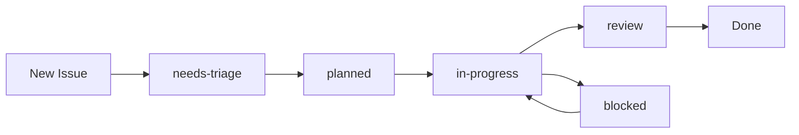

# Project Management Guide

## Overview

The Clinical BDD Creator project uses GitHub's native project management tools to coordinate work across a hybrid human-AI team. This guide explains how to effectively use Issues, Projects, Discussions, and automated workflows.

## Quick Start

### Creating an Issue

1. Go to the [Issues tab](https://github.com/hankh95/clinical-bdd-creator/issues)
2. Click "New Issue"
3. Choose the appropriate template:
   - **Feature Request**: For new features or enhancements
   - **Bug Report**: For reporting bugs or unexpected behavior
   - **Task**: For development tasks or work items
   - **Documentation**: For documentation improvements
4. Fill in the template with BDD-style acceptance criteria
5. Select appropriate agent assignment suggestion
6. Submit the issue

### Viewing the Project Board

Visit the [Project Board](https://github.com/users/hankh95/projects/2) to see:
- Current sprint work
- Backlog prioritization
- Team assignments
- Progress tracking

## Agent Assignment System

Our project uses a hybrid human-AI team. Each issue can be tagged with suggested agent assignments:

### Available Agents

| Agent | Icon | Expertise | Use For |
|-------|------|-----------|---------|
| Human Developer | 👤 | All areas | Complex decisions, architecture |
| Development Agent | 🤖 | General coding | Standard development tasks |
| Clinical Informaticist | 🏥 | Clinical domain | Clinical workflows, terminology |
| NeuroSymbolic Architect | 🧬 | Advanced AI | Knowledge graphs, reasoning |
| Clinical Knowledge QA | ✅ | Quality + Clinical | Testing clinical accuracy |
| Product Manager | 📊 | Product strategy | Requirements, hypotheses |
| DevOps Expert | 🔧 | Infrastructure | CI/CD, deployment |
| Monetization Expert | 💰 | Business model | Revenue, pricing |

### Assigning Agents

When creating an issue:
1. Review the agent list in the template
2. Select the most appropriate agent(s)
3. Add context about why that agent is suitable
4. Tag the issue with relevant labels

## Labels

### Type Labels
- `type: feature` - New features or enhancements
- `type: bug` - Bug reports
- `type: task` - Development tasks
- `type: documentation` - Documentation work

### Status Labels
- `status: needs-triage` - Newly created, needs review
- `status: planned` - Approved and prioritized
- `status: in-progress` - Currently being worked on
- `status: blocked` - Blocked by dependencies
- `status: review` - In code review
- `status: stale` - No recent activity

### Priority Labels
- `priority: p0-critical` - 🔴 Critical/Blocking/Security
- `priority: p1-high` - 🟠 High priority
- `priority: p2-medium` - 🟡 Medium priority
- `priority: p3-low` - 🟢 Low priority

### Area Labels (Auto-applied)
- `area: santiago-service` - Santiago NeuroSymbolic service
- `area: bdd-framework` - BDD testing framework
- `area: testing` - Testing infrastructure
- `area: documentation` - Documentation
- `area: devops` - DevOps and deployment
- `area: clinical-knowledge` - Clinical knowledge graphs
- `area: api` - API development

### Agent Labels (For tracking)
- `agent: human` - Assigned to human
- `agent: development` - Assigned to dev agent
- `agent: clinical-informaticist` - Clinical expert agent
- `agent: neurosymbolic-architect` - Architecture agent
- `agent: qa` - QA agent
- `agent: product-manager` - PM agent
- `agent: devops` - DevOps agent
- `agent: monetization` - Business agent

## BDD Best Practices

### Writing User Stories

Use the standard BDD format:

```
As a [role]
I want [feature]
So that [benefit]
```

Example:
```
As a clinical researcher
I want to query the knowledge graph for drug interactions
So that I can validate clinical decision support logic
```

### Writing Acceptance Criteria

Use Given-When-Then format:

```
Given [initial context]
When [action occurs]
Then [expected outcome]
```

Example:
```
Given a patient with hypertension diagnosis
When the system evaluates treatment recommendations
Then it should suggest ACE inhibitors as first-line therapy
```

### Defining Product Hypotheses

For feature requests, include a hypothesis:

```
We believe that [doing X] for [users Y] will achieve [outcome Z].
We'll know we're right when we see [metric N] move by [M%].
```

Example:
```
We believe that implementing FHIR-based data import for clinical researchers 
will reduce setup time by 50%. We'll know we're right when we see average 
onboarding time decrease from 4 hours to 2 hours.
```

## Workflows and Automation

### Automatic Issue Management

Our GitHub Actions automatically:

1. **Auto-add to Project**: New issues/PRs are automatically added to the project board
2. **Auto-label**: Issues/PRs are labeled based on file paths changed
3. **Stale Management**: Issues inactive for 60 days are marked stale, closed after 7 more days

### Issue Lifecycle



### Status Transitions

- **needs-triage** → **planned**: After triage meeting or PM approval
- **planned** → **in-progress**: When work begins
- **in-progress** → **review**: When PR is opened
- **review** → **Done**: When PR is merged
- **in-progress** → **blocked**: When blocked by dependencies

## GitHub Discussions

Use [Discussions](https://github.com/hankh95/clinical-bdd-creator/discussions) for:

### Categories

- **Announcements**: Project updates and releases
- **Ideas**: Brainstorming and proposals (before creating issues)
- **Q&A**: Questions and answers
- **General**: General project discussion
- **Show and Tell**: Demos and showcases

### When to Use Discussions vs Issues

| Use Discussions | Use Issues |
|-----------------|------------|
| Open-ended questions | Specific tasks |
| Brainstorming ideas | Defined work items |
| General discussion | Bug reports |
| Knowledge sharing | Feature requests |
| Community engagement | Trackable deliverables |

## GitHub Wiki

The [Wiki](https://github.com/hankh95/clinical-bdd-creator/wiki) contains:

- Architecture documentation
- Clinical domain knowledge
- Integration guides
- Agent collaboration patterns
- Troubleshooting guides
- Research findings

### Wiki Structure

```
Home
├── Architecture
│   ├── Santiago Service
│   ├── BDD Framework
│   └── Knowledge Graph
├── Clinical Domain
│   ├── Terminology Systems
│   ├── Clinical Guidelines
│   └── FHIR Integration
├── Development
│   ├── Setup Guide
│   ├── Testing Guide
│   └── Deployment Guide
└── Agent Collaboration
    ├── Agent Specifications
    ├── Workflow Patterns
    └── Best Practices
```

## Project Views

The project board has multiple views:

### Board View
Kanban-style board with columns:
- **Backlog**: Planned work
- **Ready**: Ready to start
- **In Progress**: Active work
- **In Review**: Code review
- **Done**: Completed

### Table View
Spreadsheet-style view with columns:
- Title
- Status
- Priority
- Area
- Assigned Agent
- Effort Estimate
- Sprint

### Roadmap View
Timeline view showing:
- Milestones
- Epics
- Release planning

### Agent Assignment View
Grouped by assigned agent to show workload distribution

## Sprint Planning

### Sprint Cadence
- **Duration**: 2 weeks
- **Planning**: Every other Monday
- **Review**: Every other Friday
- **Retrospective**: After review

### Planning Process

1. **Review backlog** (Product Manager)
2. **Prioritize issues** (Team + PM)
3. **Assign agents** (Technical Lead)
4. **Estimate effort** (Assigned agent/human)
5. **Commit to sprint** (Team)

### Sprint Ceremonies

#### Daily Standup (Async via Comments)
Each team member posts:
- What I completed yesterday
- What I'm working on today
- Any blockers

#### Sprint Review
- Demo completed work
- Review acceptance criteria
- Gather feedback

#### Retrospective
- What went well?
- What needs improvement?
- Action items for next sprint

## Issue Templates Deep Dive

### Feature Request Template

Includes:
- User story (BDD format)
- Acceptance criteria (Given-When-Then)
- Agent assignment suggestion
- Priority level
- Product hypothesis (optional)
- Clinical safety considerations

### Bug Report Template

Includes:
- Bug description
- Expected vs actual behavior (BDD format)
- Reproduction steps
- Agent assignment suggestion
- Severity level
- Clinical impact indicators

### Task Template

Includes:
- Task description
- Acceptance criteria
- Agent assignment suggestion
- Priority and effort estimate
- Task type checkboxes

### Documentation Template

Includes:
- Documentation type
- Current and desired states
- Agent assignment suggestion
- Priority level

## Best Practices

### For Human Contributors

1. **Write clear acceptance criteria** - Use BDD format
2. **Tag appropriately** - Select relevant agent and labels
3. **Link related issues** - Use #issue-number in descriptions
4. **Update status** - Keep issue status current
5. **Communicate blockers** - Flag issues immediately
6. **Review AI work** - Always review agent contributions
7. **Document decisions** - Use comments to explain choices

### For AI Agents

1. **Follow templates** - Use structured formats
2. **Request clarification** - Ask questions if unclear
3. **Show your work** - Explain reasoning in comments
4. **Link to documentation** - Reference relevant docs
5. **Suggest improvements** - Propose better approaches
6. **Test thoroughly** - Include test evidence
7. **Update status** - Move cards as work progresses

### For Product Manager

1. **Write hypotheses** - Frame features as experiments
2. **Define metrics** - Specify success criteria
3. **Prioritize ruthlessly** - Focus on highest value
4. **Facilitate ceremonies** - Run sprint activities
5. **Remove blockers** - Clear path for team
6. **Gather feedback** - Continuously improve process
7. **Track outcomes** - Measure hypothesis results

## Clinical Safety Protocols

For issues involving clinical decision support:

### Required Checks

- [ ] Clinical accuracy validation
- [ ] Evidence-based rationale documented
- [ ] Safety implications reviewed
- [ ] FHIR compliance verified
- [ ] Terminology standards followed

### Clinical Review Process

1. **Clinical Informaticist review** - Domain expert review
2. **QA validation** - Comprehensive testing
3. **Documentation** - Clinical rationale documented
4. **Approval** - Explicit approval before merge

## Metrics and Reporting

### Team Metrics

Track these via project board:
- Velocity (issues completed per sprint)
- Cycle time (issue creation to completion)
- Lead time (planned to done)
- Agent utilization
- Bug rate

### Product Metrics

Track hypothesis validation:
- Feature adoption rate
- User satisfaction
- Performance metrics
- Clinical accuracy metrics

## Support and Resources

### Getting Help

- **Technical Questions**: GitHub Discussions Q&A
- **Process Questions**: Comment on issue or PR
- **Urgent Issues**: Mention @hankh95
- **Documentation**: Check Wiki first

### Learning Resources

- [GitHub Issues Guide](https://docs.github.com/en/issues)
- [GitHub Projects Guide](https://docs.github.com/en/issues/planning-and-tracking-with-projects)
- [BDD Best Practices](https://cucumber.io/docs/bdd/)
- [Lean UX Principles](https://www.jeffgothelf.com/blog/)

## Continuous Improvement

This project management system will evolve based on:
- Team feedback
- Metrics analysis
- New tool capabilities
- Lessons learned

Suggest improvements via:
- Discussion threads
- Sprint retrospectives
- Direct feedback to PM

---

**Last Updated**: 2025-11-11  
**Version**: 1.0  
**Maintainer**: @hankh95
