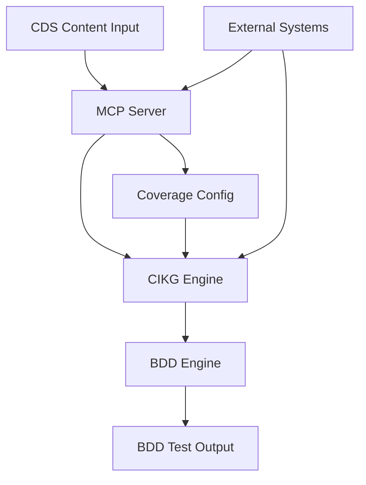

# Phase 5: System Architecture Design

## Overview

The Clinical BDD Creator is an MCP (Model Context Protocol) service that automates the generation of Behavior-Driven Development (BDD) test scenarios from clinical decision support (CDS) requirements. The system leverages a 4-layer Clinical Informatics Knowledge Graph (CIKG) model to transform clinical content into executable Gherkin test specifications.

## System Architecture

### High-Level Architecture



### Component Architecture

#### 1. MCP Server Component

**Purpose**: Provides JSON-RPC interface for external clients (IDEs, automation tools)

**Key Interfaces**:

- `initialize`: Service initialization and capability negotiation
- `configure_coverage`: Set coverage targets and categories
- `process_scenario`: Transform CDS scenario to BDD tests
- `validate_coverage`: Check coverage completeness
- `get_status`: Service health and progress reporting

**Configuration**:

- Coverage tiers (basic, standard, comprehensive)
- Category mappings (treatment_recommendation, diagnostic_test, etc.)
- Output formats (Gherkin, JSON, XML)
- Validation rules and thresholds

#### 2. CIKG Engine Component

**Purpose**: Processes clinical content through 4-layer knowledge graph transformation

**Layer Processing Pipeline**:


**Key Processing Stages**:

- **Clinical Text Analysis**: Extract medical concepts, relationships, conditions
- **Triple Extraction**: Convert to subject-predicate-object triples
- **Asset Generation**: Create reusable clinical decision components
- **Workflow Synthesis**: Build executable clinical pathways
- **Test Generation**: Transform workflows to BDD scenarios

#### 3. BDD Engine Component

**Purpose**: Generates and validates Gherkin test specifications

**Core Functions**:

- Scenario template application
- Given-When-Then structure generation
- Coverage gap analysis
- Test validation and linting
- Report generation

**Template System**:

- Predefined scenario templates for common CDS patterns
- Custom template support for specialized use cases
- Template validation and coverage mapping

### Data Flow Architecture

```
CDS Content Input
       ↓
Coverage Configuration
       ↓
┌─────────────────┐
│ MCP Server      │ ← JSON-RPC Requests
│                 │
│ • Parse Request │
│ • Validate Input│
│ • Route to CIKG │
└─────────────────┘
       ↓
┌─────────────────┐
│ CIKG Engine     │
│                 │
│ L0 → L1 → L2 → L3│
│ Processing      │
└─────────────────┘
       ↓
┌─────────────────┐
│ BDD Engine      │
│                 │
│ • Template App  │
│ • Gherkin Gen   │
│ • Validation    │
└─────────────────┘
       ↓
BDD Test Output
```

### Configuration Architecture

#### Coverage Configuration System

**Purpose**: Manages configurable coverage targets and scenario mappings

**Configuration Hierarchy**:

```
Project Defaults (YAML)
    ↓
Category Mappings (CDS → Coverage)
    ↓
Tier Definitions (Basic/Standard/Comprehensive)
    ↓
Scenario Overrides (Per-scenario customization)
    ↓
Runtime Configuration (Per-request overrides)
```

**Configuration Sources**:

- `project-coverage-defaults.md`: Base configuration
- `coverage-mapping-reference.md`: Scenario to category mappings
- Runtime parameters: Per-request customization
- User preferences: IDE/client-specific settings

#### MCP Protocol Integration

**Transport**: JSON-RPC over stdio/WebSocket
**Message Format**: Structured JSON with method calls and responses
**Error Handling**: Standardized error codes and messages
**Capability Negotiation**: Dynamic feature discovery

#### External System Integration

**Clinical Content Sources**:

- FHIR servers and resources
- CDS knowledge artifacts
- Clinical guideline repositories
- Terminology services (SNOMED CT, LOINC)

**Test Execution Integration**:

- Cucumber/Gherkin runners
- Test automation frameworks
- CI/CD pipeline integration
- Quality assurance workflows

### Configuration Architecture

#### Coverage Configuration System
**Purpose**: Manages configurable coverage targets and scenario mappings

**Configuration Hierarchy**:
```
Project Defaults (YAML)
    ↓
Category Mappings (CDS → Coverage)
    ↓
Tier Definitions (Basic/Standard/Comprehensive)
    ↓
Scenario Overrides (Per-scenario customization)
    ↓
Runtime Configuration (Per-request overrides)
```

**Configuration Sources**:
- `project-coverage-defaults.md`: Base configuration
- `coverage-mapping-reference.md`: Scenario to category mappings
- Runtime parameters: Per-request customization
- User preferences: IDE/client-specific settings

### Integration Architecture

#### MCP Protocol Integration
**Transport**: JSON-RPC over stdio/WebSocket
**Message Format**: Structured JSON with method calls and responses
**Error Handling**: Standardized error codes and messages
**Capability Negotiation**: Dynamic feature discovery

#### External System Integration
**Clinical Content Sources**:
- FHIR servers and resources
- CDS knowledge artifacts
- Clinical guideline repositories
- Terminology services (SNOMED CT, LOINC)

**Test Execution Integration**:
- Cucumber/Gherkin runners
- Test automation frameworks
- CI/CD pipeline integration
- Quality assurance workflows

### Deployment Architecture

#### Containerized Deployment
```
┌─────────────────────────────────┐
│ Docker Container                │
├─────────────────────────────────┤
│ • MCP Server (Python/FastAPI)   │
│ • CIKG Engine (Python)          │
│ • BDD Engine (Python)           │
│ • Configuration Service         │
├─────────────────────────────────┤
│ Base: python:3.11-slim          │
└─────────────────────────────────┘
```

#### Development Environment
- Local MCP server for IDE integration
- Test harness for component validation
- Mock services for external dependencies
- Development tooling and debugging

### Security Architecture

#### Data Protection
- Clinical data encryption at rest and in transit
- Access control and audit logging
- HIPAA compliance considerations
- PHI data handling guidelines

#### Service Security
- Input validation and sanitization
- Rate limiting and abuse prevention
- Secure configuration management
- Dependency vulnerability scanning

### Performance Architecture

#### Scalability Considerations
- Asynchronous processing for large CDS artifacts
- Caching layer for frequently accessed content
- Horizontal scaling for high-throughput scenarios
- Resource optimization for clinical terminology processing

#### Monitoring and Observability
- Performance metrics collection
- Error tracking and alerting
- Usage analytics and reporting
- Health check endpoints

## Implementation Roadmap

### Phase 5A: Core Architecture (Current)
- [x] System architecture design
- [ ] MCP server interface design
- [ ] CIKG processing pipeline design
- [ ] Coverage configuration system design

### Phase 5B: POC Development (Next)
- [ ] BDD generation POC
- [ ] MCP server POC
- [ ] CIKG processing POC
- [ ] Integration testing framework

### Phase 5C: Integration and Validation
- [ ] Component integration
- [ ] End-to-end testing
- [ ] Performance optimization
- [ ] Production readiness assessment

## Success Criteria

### Functional Requirements Met
- [ ] MCP server responds to JSON-RPC requests
- [ ] CIKG engine processes clinical content through all 4 layers
- [ ] BDD engine generates valid Gherkin scenarios
- [ ] Coverage configuration system supports tiered categories

### Quality Requirements Met
- [ ] Test coverage > 80% for all components
- [ ] Performance: < 5 seconds for typical CDS scenarios
- [ ] Accuracy: > 95% clinical concept extraction
- [ ] Reliability: 99.9% uptime for production deployment

### Integration Requirements Met
- [ ] Compatible with VS Code MCP extension
- [ ] Integrates with existing CDS development workflows
- [ ] Supports standard clinical terminology services
- [ ] Provides comprehensive API documentation</content>
<parameter name="filePath">/Users/hankhead/Projects/Personal/clinical-bdd-creator/design/system-architecture.md