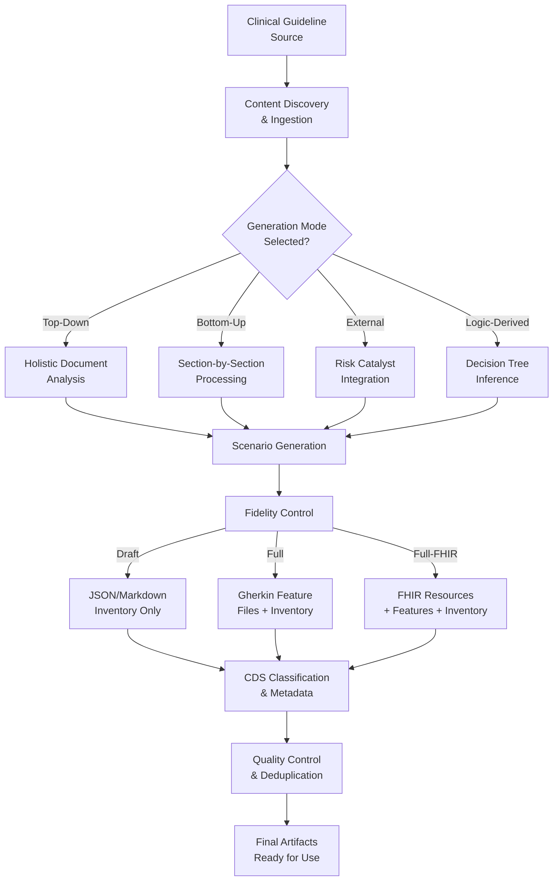

# Clinical BDD Creator - Core Requirements

**Version:** 1.1.0
**Date:** November 7, 2025

This document contains the detailed EARS-compliant requirements for the Clinical BDD Creator system, organized by functional area.

## Requirements Overview

The Clinical BDD Creator transforms clinical guideline content from any source into executable Behavior-Driven Development (BDD) test scenarios. The system analyzes clinical guideline content in various formats and generates comprehensive test scenarios covering clinical decision points, treatment recommendations, diagnostic tests, and patient safety considerations.

The system supports the CIKG 4-Layer model (L0 Prose, L1 GSRL Triples, L2 RALL Assets, L3 WATL Workflows) and aligns with CDS usage scenarios to ensure generated tests are clinically relevant and standards-compliant.

## Functional Requirements

### Content Management

#### Requirement 1: Content Discovery and Ingestion

**User Story:** As a clinical knowledge engineer, I want the System to discover and ingest clinical guideline content from multiple source formats, so that I can generate BDD scenarios from any guideline source without format-specific preprocessing.

##### Acceptance Criteria

1. WHEN a guideline source is provided, THE System SHALL accept content in formats including structured markdown, XML, HTML, PDF, FHIR Composition, and JSON manifests
2. WHEN a content manifest is provided, THE System SHALL parse the manifest to identify available guideline sections and their locations within 30 seconds
3. WHEN manifest files are missing, THE System SHALL generate a content manifest by scanning the source directory for guideline files matching common patterns (e.g., `*.md`, `*.xml`, `*.html`, `*.pdf`, `composition.json`) within 10 seconds
4. WHEN guideline sections are incomplete or missing (defined as < 3 core sections: diagnosis, treatment, monitoring), THE System SHALL report content validation errors listing specific missing sections and SHALL NOT proceed with scenario generation
5. WHERE content quality thresholds are defined (minimum 3 sections, 1000 characters per section), THE System SHALL validate that guideline content meets minimum section count (≥3) and character count requirements (≥1000 chars/section) and SHALL reject content below thresholds
6. WHEN guideline content is provided in PDF, THE System SHALL accept pre-extracted text with section markers or use OCR/text extraction tools and SHALL validate text quality (≥80% readable characters)
7. WHEN guideline content cannot be processed due to format errors or corruption, THE System SHALL raise a descriptive error and SHALL NOT generate any scenarios
8. WHEN guideline content is empty or contains <100 characters, THE System SHALL reject the input with error code "INSUFFICIENT_CONTENT"

### Scenario Generation

#### Requirement 2: Multi-Mode Scenario Generation

**User Story:** As a clinical knowledge engineer, I want the System to generate test scenarios using multiple generation strategies, so that I can achieve comprehensive coverage of clinical decision points from different analytical perspectives.

##### Acceptance Criteria

1. WHERE top-down mode is enabled, THE System SHALL generate scenarios by analyzing raw guideline source documents holistically without section-level decomposition and SHALL produce at least 5 scenarios per guideline document
2. WHERE bottom-up mode is enabled, THE System SHALL generate 3-5 scenarios per selected guideline section by analyzing structured clinical content at the section level, resulting in a minimum total of 9 scenarios for 3 sections
3. WHERE external mode is enabled, THE System SHALL incorporate scenarios from external risk catalysts such as FDA alerts, PubMed summaries, or other evidence sources and SHALL generate at least 2 external scenarios per catalyst source
4. WHERE logic-derived mode is enabled, THE System SHALL infer decision pathways from guideline content and generate scenarios covering all logical paths, ensuring 100% path coverage for decision trees with ≤5 branches
5. WHEN multiple modes are enabled, THE System SHALL execute each mode independently and merge results with deduplication, removing ≥90% of duplicate scenarios based on decision question similarity

#### Requirement 3: Section-Based Scenario Generation

**User Story:** As a clinical knowledge engineer, I want the System to generate multiple scenarios for each clinical guideline section, so that I can achieve exhaustive coverage of treatment options, diagnostic tests, and patient variations within each guideline area.

##### Acceptance Criteria

1. WHEN bottom-up mode is enabled with selected sections, THE System SHALL make separate generation calls for each selected guideline section
2. WHEN processing a guideline section, THE System SHALL generate 3-5 distinct scenarios covering different clinical decision points within that section
3. WHEN generating section-specific scenarios, THE System SHALL include the section name, type, and content in the generation prompt
4. WHEN scenarios are generated across multiple sections, THE System SHALL assign unique scenario IDs sequentially across all sections
5. WHEN section-based generation completes, THE System SHALL log the scenario count generated for each section

#### Requirement 4: Fidelity-Based Output Control

**User Story:** As a clinical knowledge engineer, I want the System to support multiple output fidelity levels, so that I can control the depth of generated artifacts based on project phase and resource constraints.

##### Acceptance Criteria

1. WHERE fidelity level is "none", THE System SHALL skip all scenario generation and produce no output files
2. WHERE fidelity level is "draft", THE System SHALL generate scenario inventory tables in JSON and Markdown formats only, containing ≥10 metadata fields per scenario
3. WHERE fidelity level is "full", THE System SHALL generate scenario inventory plus Gherkin feature files grouped by CDS category, with ≥1 feature file per category and ≥3 scenarios per file
4. WHERE fidelity level is "full-fhir", THE System SHALL generate scenario inventory, feature files, and FHIR resources including PlanDefinition, ActivityDefinition, and Library, with ≥1 FHIR resource per CDS category
5. WHEN fidelity level is "draft", THE System SHALL default to top-down and external generation modes only and SHALL complete generation within 60 seconds

### Clinical Decision Support

#### Requirement 5: CDS Taxonomy Classification

**User Story:** As a clinical knowledge engineer, I want the System to automatically classify scenarios according to the CDS usage taxonomy, so that generated tests align with standard clinical decision support categories and can be organized systematically.

##### Acceptance Criteria

1. WHEN a scenario is generated, THE System SHALL analyze the decision question and expected actions to determine the appropriate CDS category
2. WHEN the decision question contains differential diagnosis keywords, THE System SHALL classify the scenario as CDS 1.1.1 Differential Diagnosis
3. WHEN the decision question contains treatment or medication keywords, THE System SHALL classify the scenario as CDS 1.1.2 Treatment Recommendation or 1.1.3 Drug Recommendation
4. WHEN the decision question contains test or investigation keywords, THE System SHALL classify the scenario as CDS 1.1.5 Diagnostic Test Recommendation
5. WHEN CDS classification is ambiguous, THE System SHALL default to the most common category (1.1.2 Treatment Recommendation) and log the classification decision

### Asset Management

#### Requirement 6: Scenario Inventory Management

**User Story:** As a clinical knowledge engineer, I want the System to produce structured scenario inventories with comprehensive metadata, so that I can review, prioritize, and track generated test scenarios before promoting them to executable tests.

##### Acceptance Criteria

1. WHEN scenario generation completes, THE System SHALL write a scenario inventory in JSON format containing all scenarios with required fields
2. WHEN scenario generation completes, THE System SHALL write a scenario inventory in Markdown table format for human review
3. WHEN writing scenario inventory, THE System SHALL include metadata fields: scenarioId, decisionQuestion, decisionTargetWindow, patientFixture, preconditions, triggers, expectedActions, timing, contraindications, evidenceAnchor, planDefinition, negativeAssertions, timingAssertions, applyReadiness, persona, status, generationMode
4. WHEN writing scenario inventory, THE System SHALL validate that applyReadiness values are limited to: ready, blocked, needs-fixture, needs-data
5. WHEN writing scenario inventory, THE System SHALL validate that status values are limited to: draft, ready, pending

#### Requirement 7: Feature File Generation

**User Story:** As a clinical knowledge engineer, I want the System to generate Gherkin feature files grouped by CDS category, so that I can execute BDD tests organized by clinical decision support scenario type.

##### Acceptance Criteria

1. WHEN fidelity level is "full" or "full-fhir", THE System SHALL generate Gherkin feature files for all scenarios
2. WHEN generating feature files, THE System SHALL group scenarios by CDS category with one feature file per category
3. WHEN generating a feature file, THE System SHALL include a Feature header with the CDS category title and topic name
4. WHEN generating a scenario within a feature file, THE System SHALL format it using Gherkin syntax with Given/When/Then steps
5. WHEN generating a scenario, THE System SHALL include metadata comments with scenario ID, CDS category, generation mode, and evidence anchor

#### Requirement 8: FHIR Resource Generation

**User Story:** As a clinical informaticist, I want the System to generate FHIR-compliant resources for clinical decision support scenarios, so that generated tests can be integrated with FHIR-based clinical systems and validated against FHIR specifications.

##### Acceptance Criteria

1. WHEN fidelity level is "full-fhir", THE System SHALL generate PlanDefinition resources for each CDS category group
2. WHEN generating PlanDefinition resources, THE System SHALL include proper FHIR metadata including version, status, and publisher information
3. WHEN generating FHIR resources, THE System SHALL validate output against FHIR R4 or R5 schemas and SHALL report validation errors
4. WHEN FHIR generation fails validation, THE System SHALL attempt automatic correction for common issues and SHALL log uncorrectable errors
5. WHEN generating ActivityDefinition resources, THE System SHALL link them to appropriate PlanDefinition resources using canonical references

### Quality Control & Testing

#### Requirement 9: Rate Limiting and Resilience

**User Story:** As a system administrator, I want the System to implement rate limiting and resilience features, so that it can handle production workloads reliably and prevent abuse.

##### Acceptance Criteria

1. WHEN API rate limits are exceeded, THE System SHALL return HTTP 429 status with retry-after header
2. WHEN implementing rate limiting, THE System SHALL support per-key RPS limits configurable from 1-1000 requests per second
3. WHEN rate limits are hit, THE System SHALL log rate limit violations with client information for monitoring
4. WHEN system load is high, THE System SHALL implement graceful degradation by prioritizing critical operations
5. WHEN external services are unavailable, THE System SHALL implement circuit breaker patterns with configurable timeout and retry logic

#### Requirement 10: Asset Summary and Metrics

**User Story:** As a clinical knowledge engineer, I want the System to provide comprehensive metrics and summaries, so that I can assess the quality and coverage of generated clinical content.

##### Acceptance Criteria

1. WHEN requested, THE System SHALL generate asset summary reports including total counts, coverage percentages, and deduplication ratios
2. WHEN generating metrics, THE System SHALL calculate scenario coverage as (unique clinical pathways covered / total possible pathways) * 100
3. WHEN reporting deduplication metrics, THE System SHALL show both raw counts and effectiveness percentages (duplicates removed / total generated)
4. WHEN generating latency metrics, THE System SHALL report average, 95th percentile, and maximum response times per operation type
5. WHEN metrics are requested for a specific scope, THE System SHALL filter results to that scope (organization, topic, or global)

#### Requirement 11: Configuration and Customization

**User Story:** As a system administrator, I want the System to support configuration and customization, so that it can be adapted to different clinical environments and workflows.

##### Acceptance Criteria

1. WHEN configuration is requested, THE System SHALL return current settings in structured JSON format
2. WHEN configuration updates are submitted, THE System SHALL validate changes against schema and reject invalid configurations
3. WHEN configuration includes clinical terminology preferences, THE System SHALL support SNOMED CT, ICD-11, and custom code systems
4. WHEN customization settings are changed, THE System SHALL log configuration changes with timestamps and user context
5. WHEN configuration affects clinical logic, THE System SHALL require explicit confirmation for high-risk changes

#### Requirement 12: Provenance and Traceability

**User Story:** As a clinical informaticist, I want the System to maintain comprehensive provenance and traceability, so that I can audit the origin and evolution of generated clinical content.

##### Acceptance Criteria

1. WHEN content is processed, THE System SHALL generate provenance records including source URI, processing timestamp, and model information
2. WHEN scenarios are generated, THE System SHALL include provenance metadata with AI model details, prompt versions, and confidence scores
3. WHEN content is modified, THE System SHALL create audit trails showing before/after states with change rationales
4. WHEN traceability is requested, THE System SHALL provide complete lineage from source guideline to final test scenario
5. WHEN provenance data is exported, THE System SHALL support standard formats (PROV-O, W3C PROV) for interoperability

#### Requirement 13: Deduplication and Quality Control

**User Story:** As a clinical knowledge engineer, I want the System to perform deduplication and quality control, so that generated scenarios are unique and clinically accurate.

##### Acceptance Criteria

1. WHEN deduplication is requested, THE System SHALL analyze scenario similarity using decision question and expected actions
2. WHEN duplicate scenarios are found, THE System SHALL present merge options with conflict resolution for differing metadata
3. WHEN quality control is performed, THE System SHALL validate scenarios against clinical reasoning patterns and flag anomalies
4. WHEN deduplication threshold is configured, THE System SHALL use configurable similarity scores (0.0-1.0) for matching
5. WHEN quality issues are detected, THE System SHALL generate remediation suggestions with clinical rationale

#### Requirement 14: Dry Run and Testing Support

**User Story:** As a clinical knowledge engineer, I want the System to support dry run and testing modes, so that I can validate scenarios before production deployment.

##### Acceptance Criteria

1. WHEN dry run mode is enabled, THE System SHALL perform all validation steps without writing permanent artifacts
2. WHEN testing support is requested, THE System SHALL generate executable test suites in JUnit XML format
3. WHEN dry run completes, THE System SHALL provide detailed reports of what would be generated without actual creation
4. WHEN test execution is requested, THE System SHALL support both unit test generation and integration test scenarios
5. WHEN testing mode is active, THE System SHALL validate all generated content against clinical safety rules

#### Requirement 15: Error Handling and Logging

**User Story:** As a system administrator, I want the System to provide comprehensive error handling and logging, so that I can diagnose issues and maintain system reliability.

##### Acceptance Criteria

1. WHEN errors occur, THE System SHALL log detailed error information including stack traces, input parameters, and system state
2. WHEN logging is configured, THE System SHALL support multiple log levels (DEBUG, INFO, WARN, ERROR) with configurable retention
3. WHEN correlation IDs are provided, THE System SHALL include them in all log entries for request tracing
4. WHEN errors are recoverable, THE System SHALL attempt automatic remediation and log recovery actions
5. WHEN critical errors occur, THE System SHALL generate alerts with escalation paths and remediation guidance

### Advanced Features

#### Requirement 16: Guideline Source Flexibility

**User Story:** As a clinical informaticist, I want the System to support diverse guideline sources, so that I can work with content from any healthcare organization or standard.

##### Acceptance Criteria

1. WHEN guideline sources are provided, THE System SHALL accept content from multiple organizations (WHO, NIH, professional societies)
2. WHEN processing diverse sources, THE System SHALL normalize terminology and formatting differences automatically
3. WHEN source-specific logic is needed, THE System SHALL support pluggable adapters for different guideline formats
4. WHEN cross-organization content is processed, THE System SHALL flag terminology conflicts for manual resolution
5. WHEN source credibility varies, THE System SHALL weight evidence strength based on source reputation and recency

#### Requirement 17: Guideline Model Abstraction

**User Story:** As a clinical knowledge engineer, I want the System to abstract guideline models, so that I can work with clinical knowledge independently of specific guideline formats.

##### Acceptance Criteria

1. WHEN guidelines are processed, THE System SHALL extract abstract clinical models including conditions, interventions, and outcomes
2. WHEN model abstraction is performed, THE System SHALL create CIKG 4-layer representations (L0-L3)
3. WHEN abstract models are generated, THE System SHALL validate clinical consistency across abstraction layers
4. WHEN model abstraction fails, THE System SHALL provide detailed error reports with abstraction failure reasons
5. WHEN abstract models are used for generation, THE System SHALL ensure clinical fidelity is maintained through validation

### Testing & Validation

#### Requirement 18: Multi-Modal AI Validation Testing

**User Story:** As a clinical validation engineer, I want the System to validate generated BDD scenarios using multiple AI models, so that I can ensure clinical accuracy through cross-model consistency checking.

##### Acceptance Criteria

1. WHEN AI validation testing is requested, THE System SHALL submit identical prompts to multiple AI models (GPT-4, Claude, Gemini)
2. WHEN multi-modal validation runs, THE System SHALL compare generated scenarios across models and calculate consistency scores
3. WHEN consistency scores are below threshold (≥80%), THE System SHALL flag scenarios for manual review with discrepancy reports
4. WHEN validation testing completes, THE System SHALL generate comparative reports with model rankings and recommendations
5. WHEN cross-model validation identifies conflicts, THE System SHALL attempt consensus resolution using clinical reasoning rules

#### Requirement 19: Clinical Reasoning Benchmarking

**User Story:** As a clinical informaticist, I want the System to benchmark clinical reasoning performance, so that I can validate AI understanding of medical decision-making processes.

##### Acceptance Criteria

1. WHEN clinical reasoning benchmarking is requested, THE System SHALL test AI models against standardized medical cases
2. WHEN benchmarking runs, THE System SHALL measure precision and recall for clinical decision identification
3. WHEN explanation completeness is evaluated, THE System SHALL assess whether AI provides sufficient clinical rationale
4. WHEN benchmarking completes, THE System SHALL generate performance reports with confidence intervals and statistical significance
5. WHEN benchmark results are below thresholds, THE System SHALL recommend model retraining or alternative approaches

#### Requirement 20: Integration Testing with Healthcare Systems

**User Story:** As a clinical systems integrator, I want the System to test BDD scenarios against real healthcare system integrations, so that I can validate end-to-end functionality before deployment in clinical environments.

##### Acceptance Criteria

1. WHEN testing FHIR integrations, THE System SHALL validate generated resources against FHIR validation servers and SHALL achieve 100% structural compliance
2. WHEN testing CDS hooks, THE System SHALL simulate clinical workflows and SHALL validate that decision support triggers occur at correct clinical decision points
3. WHEN testing interoperability, THE System SHALL exchange data with mock EHR systems and SHALL validate data transformation accuracy ≥99%
4. WHEN testing performance, THE System SHALL benchmark response times under clinical load and SHALL ensure <2 second response times for 95th percentile
5. WHEN integration testing fails, THE System SHALL generate detailed error reports with FHIR validation messages, stack traces, and remediation recommendations

## Workflow Diagrams

### BDD Generation Process



### AI Validation Testing Workflow

```mermaid
flowchart TD
    A[Generated BDD<br/>Scenarios] --> B[Multi-Modal<br/>AI Validation]

    B --> C[Submit to GPT-4]
    B --> D[Submit to Claude]
    B --> E[Submit to Gemini]

    C --> F[Collect Responses]
    D --> F
    E --> F

    F --> G[Consistency Analysis<br/>≥80% Agreement?]

    G -->|Yes| H[Validation Passed]
    G -->|No| I[Manual Review<br/>Required]

    H --> J[Clinical Reasoning<br/>Benchmarking]
    I --> J

    J --> K[Performance Metrics<br/>Precision/Recall]

    K --> L[Integration Testing<br/>with Healthcare Systems]

    L --> M[FHIR Validation<br/>CDS Hooks Testing]

    M --> N[Test Results<br/>& Reports]
```</content>
<parameter name="filePath">/Users/hankhead/Projects/Personal/clinical-bdd-creator/spec-pack/01-ears/core-requirements.md
