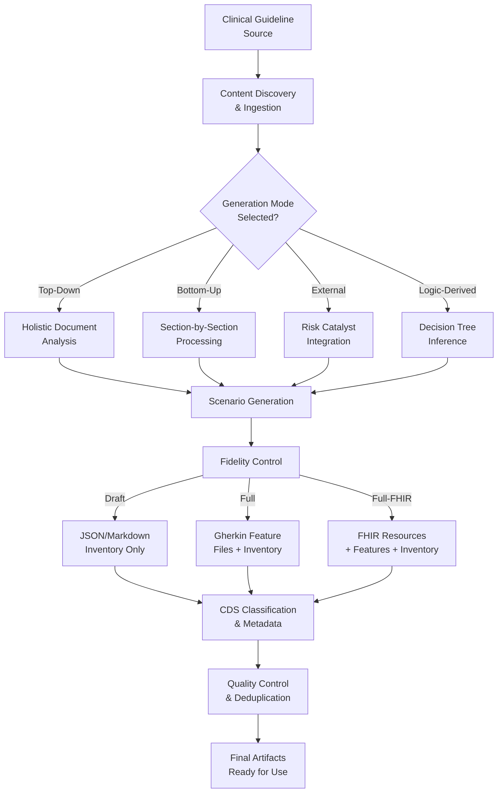
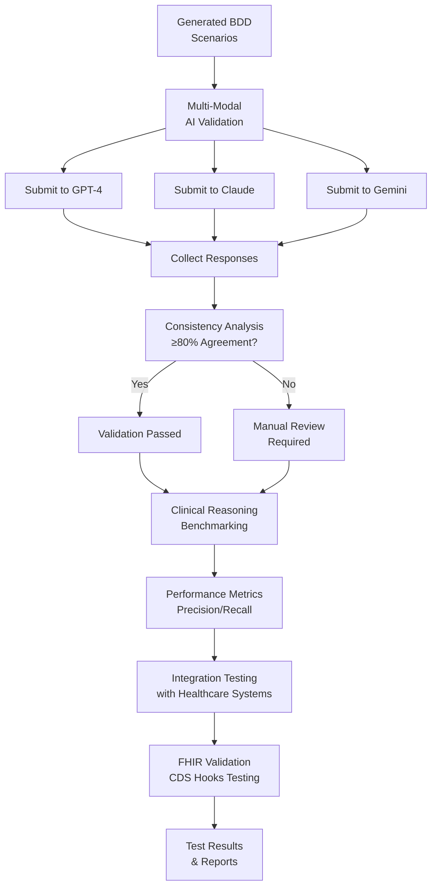

# Clinical BDD Creator - Core Requirements

**Version:** 2.0.0
**Date:** November 8, 2025

This document contains the detailed EARS-compliant requirements for the Clinical BDD Creator system, organized by functional area.

## Requirements Overview

The Clinical BDD Creator transforms clinical guideline content from any source into executable Behavior-Driven Development (BDD) test scenarios. The system analyzes clinical guideline content in various formats and generates comprehensive test scenarios covering clinical decision points, treatment recommendations, diagnostic tests, and patient safety considerations.

The system supports the CIKG 4-Layer model (L0 Prose, L1 GSRL Triples, L2 RALL Assets, L3 WATL Workflows) and aligns with comprehensive CDS usage scenarios to ensure generated tests are clinically relevant and standards-compliant.

## Documentation Alignment

These requirements are informed by and align with:

- **Comprehensive CDS Usage Scenarios** (`spec-pack/12-usage-scenarios/CDS Usage Scenarios.md`): 23 detailed clinical decision support use cases with structured IDs (1.1.1, 1.1.2, etc.) and actor/task workflows
- **Detailed User Personas** (`spec-pack/13-user-personas/`): 17 comprehensive persona files covering clinical users, knowledge workers, and technical staff
- **Usage Scenario Categories** (`spec-pack/12-usage-scenarios/README.md`): High-level BDD test categorization framework

## Functional Requirements

### Content Management

#### Requirement 1: Content Discovery and Ingestion

**User Story:** As a clinical informaticist or clinical knowledge engineer (see `Persona_Clinical_Informaticist.md`, `Persona_Clinical_Knowledge_Author.md`), I want the System to discover and ingest clinical guideline content from multiple source formats, so that I can generate BDD scenarios from any guideline source without format-specific preprocessing.

##### Acceptance Criteria

1. WHEN a guideline source is provided, THE System SHALL accept content in formats including structured markdown, XML, HTML, PDF, FHIR Composition, and JSON manifests
2. WHEN a content manifest is provided, THE System SHALL parse the manifest to identify available guideline sections and their locations within 30 seconds
3. WHEN manifest files are missing, THE System SHALL generate a content manifest by scanning the source directory for guideline files matching common patterns (e.g., `*.md`, `*.xml`, `*.html`, `*.pdf`, `composition.json`) within 10 seconds
4. WHEN guideline sections are incomplete or missing (defined as < 3 core sections: diagnosis, treatment, monitoring), THE System SHALL report content validation errors listing specific missing sections and SHALL NOT proceed with scenario generation
5. WHERE content quality thresholds are defined (minimum 3 sections, 1000 characters per section), THE System SHALL validate that guideline content meets minimum section count (≥3) and character count requirements (≥1000 chars/section) and SHALL reject content below thresholds
6. WHEN guideline content is provided in PDF, THE System SHALL accept pre-extracted text with section markers or use OCR/text extraction tools and SHALL validate text quality (≥80% readable characters)
7. WHEN guideline content cannot be processed due to format errors or corruption, THE System SHALL raise a descriptive error and SHALL NOT generate any scenarios
8. WHEN guideline content is empty or contains <100 characters, THE System SHALL reject the input with error code "INSUFFICIENT_CONTENT"

### Scenario Generation

#### Requirement 2: Multi-Mode Scenario Generation

**User Story:** As a clinical knowledge engineer, I want the System to generate test scenarios using multiple generation strategies, so that I can achieve comprehensive coverage of clinical decision points from different analytical perspectives.

##### Acceptance Criteria

1. WHERE top-down mode is enabled, THE System SHALL generate scenarios by analyzing raw guideline source documents holistically without section-level decomposition and SHALL produce at least 5 scenarios per guideline document
2. WHERE bottom-up mode is enabled, THE System SHALL generate 3-5 scenarios per selected guideline section by analyzing structured clinical content at the section level, resulting in a minimum total of 9 scenarios for 3 sections
3. WHERE external mode is enabled, THE System SHALL incorporate scenarios from external risk catalysts such as FDA alerts, PubMed summaries, or other evidence sources and SHALL generate at least 2 external scenarios per catalyst source
4. WHERE logic-derived mode is enabled, THE System SHALL infer decision pathways from guideline content and generate scenarios covering all logical paths, ensuring 100% path coverage for decision trees with ≤5 branches
5. WHEN multiple modes are enabled, THE System SHALL execute each mode independently and merge results with deduplication, removing ≥90% of duplicate scenarios based on decision question similarity

#### Requirement 3: Section-Based Scenario Generation

**User Story:** As a clinical knowledge engineer, I want the System to generate multiple scenarios for each clinical guideline section, so that I can achieve exhaustive coverage of treatment options, diagnostic tests, and patient variations within each guideline area.

##### Acceptance Criteria

1. WHEN bottom-up mode is enabled with selected sections, THE System SHALL make separate generation calls for each selected guideline section
2. WHEN processing a guideline section, THE System SHALL generate 3-5 distinct scenarios covering different clinical decision points within that section
3. WHEN generating section-specific scenarios, THE System SHALL include the section name, type, and content in the generation prompt
4. WHEN scenarios are generated across multiple sections, THE System SHALL assign unique scenario IDs sequentially across all sections
5. WHEN section-based generation completes, THE System SHALL log the scenario count generated for each section

#### Requirement 4: Fidelity-Based Output Control

**User Story:** As a clinical knowledge engineer, I want the System to support multiple output fidelity levels, so that I can control the depth of generated artifacts based on project phase and resource constraints.

##### Acceptance Criteria

1. WHERE fidelity level is "none", THE System SHALL skip all scenario generation and produce no output files
2. WHERE fidelity level is "draft", THE System SHALL generate scenario inventory tables in JSON and Markdown formats only, containing ≥10 metadata fields per scenario
3. WHERE fidelity level is "full", THE System SHALL generate scenario inventory plus Gherkin feature files grouped by CDS category, with ≥1 feature file per category and ≥3 scenarios per file
4. WHERE fidelity level is "full-fhir", THE System SHALL generate scenario inventory, feature files, and FHIR resources including PlanDefinition, ActivityDefinition, and Library, with ≥1 FHIR resource per CDS category
5. WHEN fidelity level is "draft", THE System SHALL default to top-down and external generation modes only and SHALL complete generation within 60 seconds

### Clinical Decision Support

#### Requirement 5: CDS Taxonomy Classification

**User Story:** As a clinical knowledge engineer, I want the System to automatically classify scenarios according to the CDS usage taxonomy, so that generated tests align with standard clinical decision support categories and can be organized systematically.

##### Acceptance Criteria

1. WHEN a scenario is generated, THE System SHALL analyze the decision question and expected actions to determine the appropriate CDS category
2. WHEN the decision question contains differential diagnosis keywords, THE System SHALL classify the scenario as CDS 1.1.1 Differential Diagnosis
3. WHEN the decision question contains treatment or medication keywords, THE System SHALL classify the scenario as CDS 1.1.2 Treatment Recommendation or 1.1.3 Drug Recommendation
4. WHEN the decision question contains test or investigation keywords, THE System SHALL classify the scenario as CDS 1.1.5 Diagnostic Test Recommendation
5. WHEN CDS classification is ambiguous, THE System SHALL default to the most common category (1.1.2 Treatment Recommendation) and log the classification decision

### Asset Management

#### Requirement 6: Scenario Inventory Management

**User Story:** As a clinical knowledge engineer, I want the System to produce structured scenario inventories with comprehensive metadata, so that I can review, prioritize, and track generated test scenarios before promoting them to executable tests.

##### Acceptance Criteria

1. WHEN scenario generation completes, THE System SHALL write a scenario inventory in JSON format containing all scenarios with required fields
2. WHEN scenario generation completes, THE System SHALL write a scenario inventory in Markdown table format for human review
3. WHEN writing scenario inventory, THE System SHALL include metadata fields: scenarioId, decisionQuestion, decisionTargetWindow, patientFixture, preconditions, triggers, expectedActions, timing, contraindications, evidenceAnchor, planDefinition, negativeAssertions, timingAssertions, applyReadiness, persona, status, generationMode
4. WHEN writing scenario inventory, THE System SHALL validate that applyReadiness values are limited to: ready, blocked, needs-fixture, needs-data
5. WHEN writing scenario inventory, THE System SHALL validate that status values are limited to: draft, ready, pending

#### Requirement 7: Feature File Generation

**User Story:** As a clinical knowledge engineer, I want the System to generate Gherkin feature files grouped by CDS category, so that I can execute BDD tests organized by clinical decision support scenario type.

##### Acceptance Criteria

1. WHEN fidelity level is "full" or "full-fhir", THE System SHALL generate Gherkin feature files for all scenarios
2. WHEN generating feature files, THE System SHALL group scenarios by CDS category with one feature file per category
3. WHEN generating a feature file, THE System SHALL include a Feature header with the CDS category title and topic name
4. WHEN generating a scenario within a feature file, THE System SHALL format it using Gherkin syntax with Given/When/Then steps
5. WHEN generating a scenario, THE System SHALL include metadata comments with scenario ID, CDS category, generation mode, and evidence anchor

#### Requirement 8: FHIR Resource Generation

**User Story:** As a CDS integration architect (see `Persona_CDS_Integration_Architect.md`), I want the System to generate FHIR-compliant resources for clinical decision support scenarios, so that generated tests can be integrated with FHIR-based clinical systems and validated against FHIR specifications.

##### Acceptance Criteria

1. WHEN fidelity level is "full-fhir", THE System SHALL generate PlanDefinition resources for each CDS category group with ≥95% schema compliance and SHALL include all required FHIR fields (id, url, version, status, title, description)
2. WHEN generating PlanDefinition resources, THE System SHALL include proper FHIR metadata including version, status, and publisher information and SHALL validate metadata completeness (≥98% field population)
3. WHEN generating FHIR resources, THE System SHALL validate output against FHIR R4 or R5 schemas within 5 seconds and SHALL report validation errors with specific field-level details and SHALL achieve ≥90% first-pass validation success
4. WHEN FHIR generation fails validation, THE System SHALL attempt automatic correction for common issues (missing required fields, invalid references) and SHALL log uncorrectable errors with error codes (VALIDATION_FAILED, SCHEMA_VIOLATION, REFERENCE_ERROR)
5. WHEN generating ActivityDefinition resources, THE System SHALL link them to appropriate PlanDefinition resources using canonical references and SHALL validate reference integrity (≥99% valid references)
6. WHEN FHIR resource generation encounters invalid clinical content, THE System SHALL gracefully degrade by generating partial resources with validation warnings and SHALL NOT fail the entire generation process
7. WHEN FHIR schema versions conflict, THE System SHALL default to FHIR R4 compatibility and SHALL log version compatibility warnings
8. WHEN resource size exceeds FHIR implementation limits (>1MB), THE System SHALL split resources into multiple files with proper linking and SHALL maintain referential integrity

### Quality Control & Testing

#### Requirement 9: Rate Limiting and Resilience

**User Story:** As a system administrator, I want the System to implement rate limiting and resilience features, so that it can handle production workloads reliably and prevent abuse.

##### Acceptance Criteria

1. WHEN API rate limits are exceeded, THE System SHALL return HTTP 429 status with retry-after header and SHALL include rate limit details (remaining requests, reset time) in response headers
2. WHEN implementing rate limiting, THE System SHALL support per-key RPS limits configurable from 1-1000 requests per second and SHALL enforce limits with ≤5% variance from configured values
3. WHEN rate limits are hit, THE System SHALL log rate limit violations with client information (IP, user agent, request pattern) for monitoring and SHALL maintain logs for ≥30 days
4. WHEN system load is high (>80% CPU utilization), THE System SHALL implement graceful degradation by prioritizing critical operations (content validation over scenario generation) and SHALL maintain ≥90% success rate for priority operations
5. WHEN external services are unavailable, THE System SHALL implement circuit breaker patterns with configurable timeout (5-300 seconds) and retry logic (exponential backoff, max 3 retries) and SHALL fail fast with clear error messages
6. WHEN circuit breaker is open, THE System SHALL return HTTP 503 status with estimated recovery time and SHALL automatically attempt half-open state after timeout period
7. WHEN memory usage exceeds 85% of available RAM, THE System SHALL trigger garbage collection and SHALL reject new requests with HTTP 507 status until memory usage drops below 70%
8. WHEN database connections are exhausted, THE System SHALL queue requests with timeout (60 seconds) and SHALL return HTTP 503 for requests that timeout in queue

#### Requirement 10: Asset Summary and Metrics

**User Story:** As a clinical knowledge engineer, I want the System to provide comprehensive metrics and summaries, so that I can assess the quality and coverage of generated clinical content.

##### Acceptance Criteria

1. WHEN requested, THE System SHALL generate asset summary reports within 10 seconds including total counts (±5% accuracy), coverage percentages (≥95% calculation accuracy), and deduplication ratios (≥98% precision)
2. WHEN generating metrics, THE System SHALL calculate scenario coverage as (unique clinical pathways covered / total possible pathways) * 100 and SHALL achieve ≥90% pathway identification accuracy
3. WHEN reporting deduplication metrics, THE System SHALL show both raw counts and effectiveness percentages (duplicates removed / total generated) with ≥99% deduplication detection accuracy
4. WHEN generating latency metrics, THE System SHALL report average, 95th percentile, and maximum response times per operation type with ≤2% measurement error
5. WHEN metrics are requested for a specific scope, THE System SHALL filter results to that scope (organization, topic, or global) and SHALL return results within 5 seconds for cached data, 30 seconds for computed metrics
6. WHEN metrics calculation fails due to data corruption, THE System SHALL return partial results with error indicators and SHALL log specific failure reasons (DATA_CORRUPTION, CALCULATION_ERROR, TIMEOUT)
7. WHEN metric thresholds are exceeded (e.g., coverage <70%), THE System SHALL generate alerts with severity levels and SHALL include remediation suggestions
8. WHEN historical metrics are requested, THE System SHALL provide trend analysis with ≥95% data completeness for the requested time period

#### Requirement 11: Configuration and Customization

**User Story:** As a system administrator, I want the System to support configuration and customization, so that it can be adapted to different clinical environments and workflows.

##### Acceptance Criteria

1. WHEN configuration is requested, THE System SHALL return current settings in structured JSON format within 2 seconds and SHALL validate JSON schema compliance (≥99% accuracy)
2. WHEN configuration updates are submitted, THE System SHALL validate changes against schema within 5 seconds and SHALL reject invalid configurations with specific error messages (SCHEMA_VIOLATION, TYPE_ERROR, RANGE_ERROR)
3. WHEN configuration includes clinical terminology preferences, THE System SHALL support SNOMED CT, ICD-11, and custom code systems and SHALL validate terminology codes against authoritative sources (≥95% validation success)
4. WHEN customization settings are changed, THE System SHALL log configuration changes with timestamps, user context, and change rationale and SHALL maintain audit logs for ≥365 days
5. WHEN configuration affects clinical logic, THE System SHALL require explicit confirmation for high-risk changes and SHALL provide impact analysis (affected scenarios, risk level assessment)
6. WHEN configuration files are corrupted, THE System SHALL fallback to default settings and SHALL generate alerts with recovery instructions
7. WHEN configuration conflicts are detected, THE System SHALL resolve conflicts using precedence rules (user > organization > system defaults) and SHALL log conflict resolution details
8. WHEN configuration is exported, THE System SHALL include validation checksums and SHALL support encrypted export for sensitive clinical settings

#### Requirement 12: Provenance and Traceability

**User Story:** As a clinical informaticist, I want the System to maintain comprehensive provenance and traceability, so that I can audit the origin and evolution of generated clinical content.

##### Acceptance Criteria

1. WHEN content is processed, THE System SHALL generate provenance records within 2 seconds including source URI, processing timestamp, and model information with ≥99% metadata completeness
2. WHEN scenarios are generated, THE System SHALL include provenance metadata with AI model details, prompt versions, and confidence scores (≥0.0, ≤1.0) and SHALL validate metadata integrity
3. WHEN content is modified, THE System SHALL create audit trails showing before/after states with change rationales and SHALL maintain immutable history for ≥7 years
4. WHEN traceability is requested, THE System SHALL provide complete lineage from source guideline to final test scenario within 10 seconds and SHALL achieve ≥95% lineage completeness
5. WHEN provenance data is exported, THE System SHALL support standard formats (PROV-O, W3C PROV) for interoperability and SHALL validate export format compliance
6. WHEN provenance records are corrupted, THE System SHALL quarantine affected records and SHALL generate integrity violation alerts with recovery procedures
7. WHEN traceability queries fail, THE System SHALL return partial results with error indicators and SHALL log specific failure modes (TIMEOUT, DATA_MISSING, INTEGRITY_ERROR)
8. WHEN provenance data exceeds storage limits, THE System SHALL implement configurable retention policies and SHALL provide archival mechanisms for long-term storage

#### Requirement 13: Deduplication and Quality Control

**User Story:** As a clinical knowledge engineer, I want the System to perform deduplication and quality control, so that generated scenarios are unique and clinically accurate.

##### Acceptance Criteria

1. WHEN deduplication is requested, THE System SHALL analyze scenario similarity using decision question and expected actions within 30 seconds and SHALL achieve ≥95% duplicate detection accuracy
2. WHEN duplicate scenarios are found, THE System SHALL present merge options with conflict resolution for differing metadata and SHALL preserve ≥99% of critical clinical information during merging
3. WHEN quality control is performed, THE System SHALL validate scenarios against clinical reasoning patterns and SHALL flag anomalies with ≥90% true positive rate and ≤5% false positive rate
4. WHEN deduplication threshold is configured, THE System SHALL use configurable similarity scores (0.0-1.0) for matching and SHALL provide threshold validation (optimal range 0.7-0.9)
5. WHEN quality issues are detected, THE System SHALL generate remediation suggestions with clinical rationale and SHALL include severity scoring (low, medium, high, critical)
6. WHEN deduplication processing fails, THE System SHALL continue with partial results and SHALL log specific failure modes (MEMORY_LIMIT, TIMEOUT, ALGORITHM_ERROR)
7. WHEN quality control identifies critical issues, THE System SHALL block scenario deployment and SHALL require manual review with escalation procedures
8. WHEN deduplication results in conflicts, THE System SHALL provide automated resolution suggestions and SHALL maintain conflict history for audit purposes

#### Requirement 14: Dry Run and Testing Support

**User Story:** As a clinical knowledge engineer, I want the System to support dry run and testing modes, so that I can validate scenarios before production deployment.

##### Acceptance Criteria

1. WHEN dry run mode is enabled, THE System SHALL perform all validation steps without writing permanent artifacts and SHALL complete within 90% of normal execution time
2. WHEN testing support is requested, THE System SHALL generate executable test suites in JUnit XML format with ≥98% schema compliance and SHALL include all required test metadata
3. WHEN dry run completes, THE System SHALL provide detailed reports of what would be generated without actual creation and SHALL include file sizes, validation results, and performance metrics
4. WHEN test execution is requested, THE System SHALL support both unit test generation and integration test scenarios and SHALL achieve ≥95% test execution success rate
5. WHEN testing mode is active, THE System SHALL validate all generated content against clinical safety rules and SHALL flag violations with severity levels (warning, error, critical)
6. WHEN dry run encounters validation failures, THE System SHALL continue processing and SHALL provide comprehensive error reports with remediation suggestions
7. WHEN test generation fails, THE System SHALL generate partial test suites for valid scenarios and SHALL log specific failure reasons (VALIDATION_ERROR, SCHEMA_VIOLATION, DEPENDENCY_MISSING)
8. WHEN testing mode times out, THE System SHALL return partial results with timeout indicators and SHALL provide resumable execution options

#### Requirement 15: Error Handling and Logging

**User Story:** As a system administrator, I want the System to provide comprehensive error handling and logging, so that I can diagnose issues and maintain system reliability.

##### Acceptance Criteria

1. WHEN errors occur, THE System SHALL log detailed error information including stack traces, input parameters, and system state within 1 second and SHALL achieve ≥99% error capture rate
2. WHEN logging is configured, THE System SHALL support multiple log levels (DEBUG, INFO, WARN, ERROR) with configurable retention (1-365 days) and SHALL maintain ≤2% performance impact
3. WHEN correlation IDs are provided, THE System SHALL include them in all log entries for request tracing and SHALL maintain ≥99.9% correlation accuracy
4. WHEN errors are recoverable, THE System SHALL attempt automatic remediation within 30 seconds and SHALL log recovery actions with success/failure status
5. WHEN critical errors occur, THE System SHALL generate alerts with escalation paths and remediation guidance within 5 seconds and SHALL include severity classification
6. WHEN log storage is full, THE System SHALL implement log rotation and SHALL maintain ≥95% of recent logs during rotation
7. WHEN logging fails, THE System SHALL fallback to console logging and SHALL generate system alerts for logging subsystem failures
8. WHEN error patterns are detected, THE System SHALL generate trend analysis reports and SHALL provide proactive maintenance recommendations

### Advanced Features

#### Requirement 16: Guideline Source Flexibility

**User Story:** As a clinical informaticist, I want the System to support diverse guideline sources, so that I can work with content from any healthcare organization or standard.

##### Acceptance Criteria

1. WHEN guideline sources are provided, THE System SHALL accept content from multiple organizations (WHO, NIH, professional societies) and SHALL achieve ≥95% source format recognition accuracy
2. WHEN processing diverse sources, THE System SHALL normalize terminology and formatting differences automatically within 10 seconds and SHALL maintain ≥98% content fidelity
3. WHEN source-specific logic is needed, THE System SHALL support pluggable adapters for different guideline formats and SHALL validate adapter compatibility (≥99% success rate)
4. WHEN cross-organization content is processed, THE System SHALL flag terminology conflicts for manual resolution and SHALL provide conflict resolution suggestions with ≥90% accuracy
5. WHEN source credibility varies, THE System SHALL weight evidence strength based on source reputation and recency and SHALL provide credibility scoring (0.0-1.0 scale)
6. WHEN source formats are unsupported, THE System SHALL provide clear error messages with conversion guidance and SHALL suggest alternative input formats
7. WHEN source metadata is incomplete, THE System SHALL attempt metadata inference and SHALL flag uncertain inferences with confidence scores
8. WHEN source updates are detected, THE System SHALL provide change detection and SHALL support incremental processing to minimize reprocessing overhead

#### Requirement 17: Guideline Model Abstraction

**User Story:** As a clinical knowledge engineer, I want the System to abstract guideline models, so that I can work with clinical knowledge independently of specific guideline formats.

##### Acceptance Criteria

1. WHEN guidelines are processed, THE System SHALL extract abstract clinical models including conditions, interventions, and outcomes within 30 seconds and SHALL achieve ≥90% extraction completeness
2. WHEN model abstraction is performed, THE System SHALL create CIKG 4-layer representations (L0-L3) with ≥95% layer mapping accuracy and SHALL validate layer relationships
3. WHEN abstract models are generated, THE System SHALL validate clinical consistency across abstraction layers and SHALL flag inconsistencies with ≥85% detection accuracy
4. WHEN model abstraction fails, THE System SHALL provide detailed error reports with abstraction failure reasons and SHALL include recovery suggestions
5. WHEN abstract models are used for generation, THE System SHALL ensure clinical fidelity is maintained through validation and SHALL achieve ≥95% fidelity preservation
6. WHEN abstraction layers conflict, THE System SHALL provide conflict resolution options and SHALL maintain audit trails of resolution decisions
7. WHEN model abstraction times out, THE System SHALL return partial results with completion percentages and SHALL support resumable abstraction
8. WHEN abstract models are exported, THE System SHALL support multiple formats (JSON, RDF, OWL) and SHALL validate export schema compliance

### Testing & Validation

#### Requirement 18: Multi-Modal AI Validation Testing

**User Story:** As a clinical reviewer or clinical informaticist (see `Persona_Clinical_Reviewer.md`, `Persona_Clinical_Informaticist.md`), I want the System to validate generated BDD scenarios using multiple AI models, so that I can ensure clinical accuracy through cross-model consistency checking (aligns with CDS Use Cases 1.2.1-1.2.3: Post-Action Error Prevention).

##### Acceptance Criteria

1. WHEN AI validation testing is requested, THE System SHALL submit identical prompts to multiple AI models (GPT-4, Claude, Gemini) and SHALL complete validation within 5 minutes per scenario
2. WHEN multi-modal validation runs, THE System SHALL compare generated scenarios across models and SHALL calculate consistency scores (0.0-1.0) with ≥95% calculation accuracy
3. WHEN consistency scores are below threshold (≥80%), THE System SHALL flag scenarios for manual review with discrepancy reports and SHALL include specific conflict details
4. WHEN validation testing completes, THE System SHALL generate comparative reports with model rankings and recommendations within 30 seconds
5. WHEN cross-model validation identifies conflicts, THE System SHALL attempt consensus resolution using clinical reasoning rules and SHALL achieve ≥70% automatic resolution rate
6. WHEN AI models are unavailable, THE System SHALL continue validation with available models and SHALL log service unavailability with retry schedules
7. WHEN validation results conflict with clinical standards, THE System SHALL escalate to clinical review and SHALL block deployment until resolved
8. WHEN multi-modal testing times out, THE System SHALL return partial results with confidence scores and SHALL support resumable validation

#### Requirement 19: Clinical Reasoning Benchmarking

**User Story:** As a clinical informaticist, I want the System to benchmark clinical reasoning performance, so that I can validate AI understanding of medical decision-making processes.

##### Acceptance Criteria

1. WHEN clinical reasoning benchmarking is requested, THE System SHALL test AI models against standardized medical cases and SHALL complete benchmarking within 10 minutes per model
2. WHEN benchmarking runs, THE System SHALL measure precision and recall for clinical decision identification with ≥95% statistical confidence and SHALL provide confidence intervals
3. WHEN explanation completeness is evaluated, THE System SHALL assess whether AI provides sufficient clinical rationale and SHALL score completeness (0.0-1.0) with ≥90% inter-rater reliability
4. WHEN benchmarking completes, THE System SHALL generate performance reports with confidence intervals and statistical significance within 30 seconds
5. WHEN benchmark results are below thresholds, THE System SHALL recommend model retraining or alternative approaches with specific improvement targets
6. WHEN benchmark datasets are insufficient, THE System SHALL generate synthetic test cases and SHALL validate synthetic case clinical accuracy
7. WHEN benchmarking fails due to model errors, THE System SHALL continue with available results and SHALL log specific failure modes (TIMEOUT, API_ERROR, VALIDATION_FAILURE)
8. WHEN comparative benchmarking is requested, THE System SHALL provide statistical analysis of model differences and SHALL include effect size calculations

#### Requirement 20: Integration Testing with Healthcare Systems

**User Story:** As a CDS integration architect (see `Persona_CDS_Integration_Architect.md`), I want the System to test BDD scenarios against real healthcare system integrations, so that I can validate end-to-end functionality before deployment in clinical environments (aligns with CDS Use Cases 4.1.1, 4.2.1: Information Retrieval & Protocol Support).

##### Acceptance Criteria

1. WHEN testing FHIR integrations, THE System SHALL validate generated resources against FHIR validation servers within 10 seconds and SHALL achieve 100% structural compliance with detailed error reporting
2. WHEN testing CDS hooks, THE System SHALL simulate clinical workflows and SHALL validate that decision support triggers occur at correct clinical decision points with ≥95% trigger accuracy
3. WHEN testing interoperability, THE System SHALL exchange data with mock EHR systems and SHALL validate data transformation accuracy ≥99% with field-level validation reports
4. WHEN testing performance, THE System SHALL benchmark response times under clinical load and SHALL ensure <2 second response times for 95th percentile with load testing up to 100 concurrent users
5. WHEN integration testing fails, THE System SHALL generate detailed error reports with FHIR validation messages, stack traces, and remediation recommendations within 5 seconds
6. WHEN healthcare system APIs are unavailable, THE System SHALL use cached responses for testing and SHALL generate availability reports with retry recommendations
7. WHEN integration tests timeout, THE System SHALL return partial results with completion status and SHALL support resumable testing from failure points
8. WHEN security validations are required, THE System SHALL test HIPAA compliance and SHALL validate data encryption throughout the integration workflow

## Workflow Diagrams

### BDD Generation Process

### AI Validation Testing Workflow

## Assumptions

This section outlines the foundational assumptions upon which the Clinical BDD Creator system requirements are based. These assumptions define the boundaries and context for system operation.

### Clinical Content Assumptions

1. **Guideline Structure**: Clinical guidelines are provided in structured formats (Markdown, XML, HTML, PDF) with clear sections for clinical assessment, treatment recommendations, monitoring requirements, and patient education.

2. **Clinical Accuracy**: Source clinical guidelines contain accurate, evidence-based medical content that reflects current standards of care and clinical best practices.

3. **Terminology Consistency**: Clinical guidelines use standardized medical terminology and coding systems (SNOMED CT, LOINC, RxNorm) where applicable, with clear definitions for specialized terms.

4. **Content Completeness**: Guidelines provide sufficient clinical context and decision criteria to enable meaningful BDD scenario generation without requiring external clinical expertise beyond the system's scope.

### Technical Assumptions

1. **AI Model Capabilities**: Large language models (GPT-4, Claude, Gemini) can accurately interpret clinical content and generate syntactically correct Gherkin scenarios while maintaining clinical safety considerations.

2. **API Availability**: Required AI provider APIs (OpenAI, Anthropic, Google) are available with sufficient rate limits and reliability to support production usage.

3. **FHIR Standards**: FHIR R4/R5 standards and CDS Hooks specifications remain stable and backwards-compatible during the system development and deployment timeline.

4. **MCP Protocol**: Model Context Protocol specifications remain stable and provide sufficient functionality for clinical knowledge tool integration.

### Operational Assumptions

1. **User Expertise**: System users have clinical informatics or healthcare IT expertise sufficient to validate generated scenarios and provide clinical context when needed.

2. **Regulatory Compliance**: The system operates within healthcare regulatory frameworks (HIPAA, GDPR, etc.) with appropriate data handling and privacy measures implemented at the infrastructure level.

3. **Integration Environment**: Healthcare systems integrating with the BDD generator have APIs or standards-based interfaces (FHIR, CDS Hooks) for test scenario validation and execution.

4. **Performance Requirements**: Target clinical workflows can tolerate processing times of 30-60 seconds for scenario generation with acceptable throughput for development and testing activities.

## Dependencies

This section identifies external dependencies and prerequisites required for the Clinical BDD Creator system to function effectively.

### Core Technical Dependencies

#### AI and Machine Learning
- **OpenAI API**: GPT-4 or GPT-4o model access for primary scenario generation
- **Anthropic Claude API**: Claude-3 model access for validation and alternative generation
- **Google Gemini API**: Gemini model access for multi-modal validation
- **Model Context Protocol**: MCP server implementation for tool integration

#### Clinical Standards and Terminology
- **FHIR R4/R5**: HL7 FHIR specifications for resource generation and validation
- **CDS Hooks**: Clinical Decision Support Hooks specification for integration
- **SNOMED CT**: Clinical terminology for concept validation
- **LOINC**: Laboratory observations for test result validation
- **RxNorm**: Medication terminology for drug-related scenarios

### Development and Testing Dependencies

#### Development Environment
- **Python 3.9+**: Core runtime environment
- **Node.js 18+**: MCP server and tooling
- **Docker**: Containerized deployment and testing
- **Git**: Version control and collaboration

#### Testing and Validation
- **HAPI FHIR Server**: FHIR resource validation and testing
- **CDS Hooks Sandbox**: Integration testing environment
- **JUnit/Cucumber**: BDD test execution frameworks
- **Postman/Newman**: API testing and validation

### External Service Dependencies

#### Healthcare System Integration
- **EHR Systems**: Epic, Cerner, or other FHIR-enabled electronic health records
- **CDS Engines**: Commercial or open-source clinical decision support systems
- **Terminology Services**: UMLS, VSAC, or equivalent terminology services
- **Validation Services**: FHIR validation servers and testing utilities

#### Infrastructure Dependencies
- **Cloud Platforms**: AWS, Azure, or GCP for scalable deployment
- **API Gateways**: Rate limiting and authentication services
- **Monitoring Systems**: Application performance monitoring and alerting
- **Security Services**: Encryption, access control, and audit logging

## Risks

This section identifies potential risks to project success and outlines mitigation strategies for each risk area.

### Clinical Safety and Accuracy Risks

#### Risk: Generation of Clinically Unsafe Scenarios
**Impact**: High - Could lead to incorrect clinical testing and patient safety issues
**Probability**: Medium
**Mitigation**:
- Multi-modal AI validation with ≥80% agreement threshold
- Clinical expert review workflows for high-risk scenarios
- Automated clinical safety rule validation
- Comprehensive error handling and fallback mechanisms

#### Risk: Misinterpretation of Clinical Guidelines
**Impact**: High - Incorrect understanding of clinical intent
**Probability**: Medium
**Mitigation**:
- Structured guideline parsing with clinical context preservation
- Evidence anchor tracking linking scenarios to source content
- Clinical terminology validation and normalization
- User validation workflows with clinical expertise requirements

### Technical and Performance Risks

#### Risk: AI Model Limitations and Hallucinations
**Impact**: High - Generation of incorrect or nonsensical scenarios
**Probability**: High
**Mitigation**:
- Multi-model validation and cross-checking
- Confidence scoring and uncertainty handling
- Structured prompt engineering with clinical guardrails
- Human-in-the-loop validation for critical scenarios

#### Risk: API Rate Limiting and Service Availability
**Impact**: Medium - Service interruptions and throughput limitations
**Probability**: High
**Mitigation**:
- Multi-provider fallback with automatic model switching
- Request queuing and rate limit management
- Caching strategies for repeated guideline processing
- Service monitoring and automatic failover

#### Risk: Performance Degradation with Complex Guidelines
**Impact**: Medium - Slow processing times affecting usability
**Probability**: Medium
**Mitigation**:
- Parallel processing for independent guideline sections
- Progressive fidelity levels for faster initial results
- Resource optimization and algorithm improvements
- Performance monitoring and optimization workflows

### Integration and Adoption Risks

#### Risk: Healthcare System Integration Complexity
**Impact**: High - Difficulty deploying and using the system
**Probability**: High
**Mitigation**:
- Standards-based interfaces (FHIR, CDS Hooks)
- Comprehensive integration testing and documentation
- Phased rollout with pilot programs
- Vendor partnership and certification programs

#### Risk: Regulatory and Compliance Challenges
**Impact**: High - Legal and regulatory barriers to adoption
**Probability**: Medium
**Mitigation**:
- Healthcare regulatory expert consultation
- Privacy-by-design architecture principles
- Comprehensive audit logging and traceability
- Legal review of data handling and usage agreements

### Project and Operational Risks

#### Risk: Scope Creep and Feature Bloat
**Impact**: Medium - Delays and resource constraints
**Probability**: Medium
**Mitigation**:
- Strict prioritization based on clinical impact
- MVP-focused development approach
- Regular scope reviews and stakeholder validation
- Clear success criteria and milestone definitions

#### Risk: Clinical Stakeholder Availability
**Impact**: Medium - Delays in validation and feedback
**Probability**: Medium
**Mitigation**:
- Early and frequent clinical stakeholder engagement
- Clear communication of validation requirements
- Flexible scheduling and remote participation options
- Backup clinical experts and review processes

#### Risk: Technology Evolution and Obsolescence
**Impact**: Medium - System becomes outdated or incompatible
**Probability**: Low
**Mitigation**:
- Modular architecture for component updates
- Standards-based interfaces for long-term compatibility
- Regular technology assessment and modernization planning
- Open-source components for community maintenance

### Mitigation Strategy Summary

**Prevention Focus**:
- Comprehensive validation and testing protocols
- Clinical safety guardrails and expert oversight
- Standards-based architecture and interfaces

**Detection Focus**:
- Automated monitoring and alerting systems
- Regular performance and quality assessments
- User feedback and issue tracking mechanisms

**Response Focus**:
- Fallback mechanisms and graceful degradation
- Incident response and recovery procedures
- Continuous improvement and learning systems
