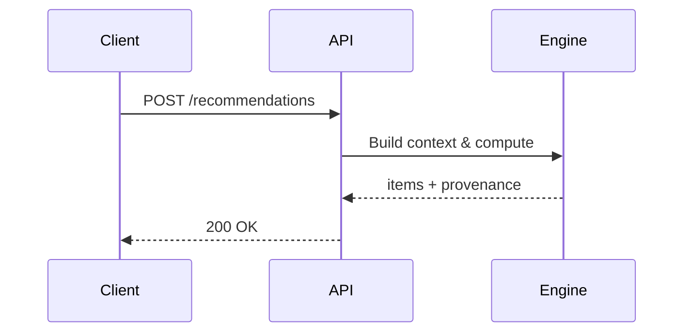

```mermaid
sequenceDiagram
  participant C as Client
  participant API as API
  participant ENG as Engine
  C->>API: POST /recommendations
  API->>ENG: Build context & compute
  ENG-->>API: items + provenance
  API-->>C: 200 OK
```
