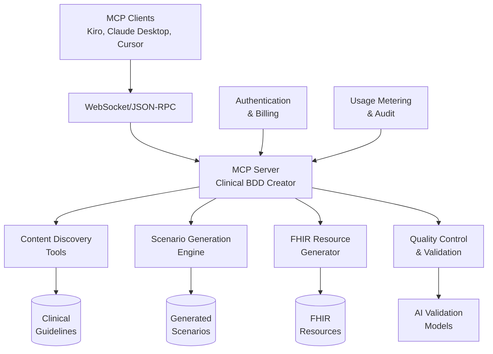

# MCP Service Specifications

**Version:** 1.1.0
**Date:** November 7, 2025

This document defines the Model Context Protocol (MCP) specifications for the Clinical BDD Creator service, including protocol details, tool definitions, and security requirements.

## Protocol & Contracts

- **Transport:** JSON-RPC over stdio and WebSocket (MCP-compatible)
- **Manifest:** `mcp.json` describing tools, resources, and model capabilities
- **Schema:** All inputs/outputs use JSON Schema references; FHIR outputs conform to R4/R5 profiles where applicable
- **Provenance:** Every response includes `provenance` block (source, hash, model, prompt_id, timestamps, checksum)
- **Versioning:** Semantic versioning for tools; deprecation policy with warning window

## Tools (Initial Set)

### Content Management Tools

- `discover_sources(uri, format, auth)` → list of documents/sections
- `ingest_guideline(uri, format, org, topic, tags[])` → asset ids + provenance

### Scenario Generation Tools

- `generate_scenarios(topic_id, mode, sections[], fidelity, provider, model)` → scenarios + mapping
- `generate_scenarios_by_section(topic_id, sections[])` → scenarios with section lineage
- `generate_feature_file(asset_id, style="EARS|Gherkin")` → feature file text + write suggestion

### Clinical Decision Support Tools

- `classify_cds(asset_id, taxonomy="order|assessment|monitor|education|referral")` → labels + confidence
- `generate_fhir(asset_id, target="PlanDefinition|CaseFeatureDefinition|Bundle")` → FHIR JSON
- `diagnosis_rank(case_features[], top_k)` → ranked list w/ rationales

### Asset Management Tools

- `list_assets(filter, page, size, sort)` / `get_asset(id)` / `delete_asset(id)`
- `dedupe_assets(scope, threshold)` → merge plan + conflicts

### Quality Control Tools

- `qc_validate(asset_id, ruleset="SHACL|JSONSchema")` → issues + fixes
- `metrics(scope)` → counts, coverage %, dedupe ratio, latency
- `run_tests(suite_uri)` → results + junit.xml

### System Management Tools

- `get_config()` / `set_config(patch)`
- `get_logs(correlation_id?, last_n?)`

**Note:** All write-tools accept `dry_run: true` parameter for safe testing.

## Security, Auth, and Monetization

### Authentication

- **API Keys:** Bearer token authentication for all requests
- **OAuth:** Optional OAuth 2.0 integration for enterprise deployments
- **Key Management:** Customer-managed encryption keys for sensitive data

### Billing & Usage

- **Stripe Integration:** Usage-based billing with subscription tiers
- **Metering:** Per-tool usage tracking with monthly caps
- **Rate Limits:** Configurable RPS (requests per second) and TPM (tokens per minute) limits

### Privacy & Compliance

- **PII/PHI Handling:** Built-in redaction utilities and data sanitization
- **HIPAA Compliance:** Signed Business Associate Agreement (BAA) support
- **Audit Trail:** Immutable usage ledger with correlation IDs and export capabilities

### Error Handling

- **Rate Limit Response:** HTTP 429 with retry-after headers
- **Security Violations:** Immediate key revocation and incident logging
- **Data Validation:** Input sanitization and schema validation for all endpoints

## Client Configuration Examples

### Kiro (.kiro/mcp.json)

```json
{
  "servers": [
    {
      "name": "cikg-mcp",
      "command": "cikg-mcp",
      "args": ["--ws", "wss://api.example.com/mcp"],
      "env": {"MCP_API_KEY": "•••"}
    }
  ]
}
```

### Claude Desktop (~/.claude/mcp/settings.json)

```json
{
  "mcpServers": {
    "cikg-mcp": {
      "command": "node",
      "args": ["dist/server.js"],
      "env": {"MCP_API_KEY": "•••"}
    }
  }
}
```

### Cursor (settings.json > mcp)

```json
{
  "mcp": {
    "providers": [{ "name": "cikg-mcp", "url": "wss://api.example.com/mcp" }]
  }
}
```

## Architecture Overview



This modular specification ensures clean separation between MCP protocol concerns and clinical domain logic.
