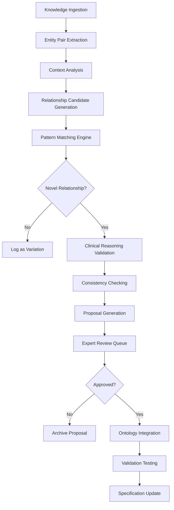

# Dynamic Relationship Discovery and Evaluation

**Version:** 1.0.0
**Date:** November 10, 2025
**Feature ID:** AI-DRDE-001

## Executive Summary

The Dynamic Relationship Discovery and Evaluation (DRDE) feature enables the Santiago knowledge graph to automatically evaluate new clinical knowledge as it is encountered and determine whether new semantic relationships need to be appended to the existing relationship ontology. This feature enhances the graph's ability to adapt to new clinical domains, emerging medical knowledge, and evolving clinical practice patterns.

## Feature Overview

### Problem Statement
The current Santiago Layer 1 semantic relationships are statically defined and limited to 22 predefined relationship types (7 original + 6 SNOMED CT + 9 FHIR-CPG). As the system encounters new clinical knowledge from diverse sources, it cannot automatically identify and incorporate novel relationship patterns that may be clinically significant but not yet represented in the ontology.

### Solution
Implement an AI-powered dynamic relationship discovery system that:
- Analyzes new knowledge entities and their interactions
- Evaluates relationship patterns against existing ontology
- Proposes new relationship types when novel patterns are detected
- Validates proposed relationships through clinical reasoning and consistency checks
- Integrates approved relationships into the core ontology

## Functional Requirements

### Requirement 1: Knowledge Ingestion and Analysis

**User Story:** As a clinical knowledge engineer, I want the system to analyze new clinical knowledge entities as they are ingested, so that I can identify potential new relationship patterns that aren't covered by the existing ontology.

#### Acceptance Criteria

1. WHEN new clinical knowledge is ingested (entities, concepts, or triples), THE System SHALL extract all entity pairs and their contextual relationships
2. WHEN analyzing entity pairs, THE System SHALL identify the semantic context including domain concepts, clinical actions, and relationship indicators
3. WHEN entity pairs are analyzed, THE System SHALL classify them by relationship category (treatment, diagnostic, pathophysiological, risk, etc.)
4. WHEN analysis is complete, THE System SHALL generate relationship candidates with confidence scores based on contextual evidence
5. WHEN confidence scores are below threshold (≤0.3), THE System SHALL flag candidates for manual review and SHALL NOT auto-approve them

### Requirement 2: Relationship Pattern Matching

**User Story:** As a clinical informaticist, I want the system to compare new relationship patterns against the existing ontology, so that I can determine whether novel relationships represent genuine gaps or variations of existing relationships.

#### Acceptance Criteria

1. WHEN a relationship candidate is identified, THE System SHALL compare it against all existing relationship types using semantic similarity analysis
2. WHEN semantic similarity is high (≥0.8), THE System SHALL classify the candidate as a variation of existing relationship and SHALL NOT propose it as new
3. WHEN semantic similarity is moderate (0.4-0.8), THE System SHALL flag for expert review with similarity scores and SHALL suggest the most similar existing relationship
4. WHEN semantic similarity is low (<0.4), THE System SHALL treat the candidate as potentially novel and SHALL proceed with detailed evaluation
5. WHEN pattern matching completes, THE System SHALL log all comparisons with similarity scores for audit purposes

### Requirement 3: Novel Relationship Evaluation

**User Story:** As a clinical knowledge engineer, I want the system to evaluate potentially novel relationships using clinical reasoning and consistency checks, so that I can determine their clinical validity and appropriateness for inclusion.

#### Acceptance Criteria

1. WHEN a potentially novel relationship is identified, THE System SHALL perform clinical reasoning validation using domain knowledge
2. WHEN evaluating clinical validity, THE System SHALL check relationship consistency with established medical knowledge and SHALL reject relationships that contradict known clinical facts
3. WHEN assessing relationship utility, THE System SHALL evaluate whether the relationship enables new clinical insights or decision support capabilities
4. WHEN performing consistency checks, THE System SHALL verify that the proposed relationship doesn't create logical contradictions with existing relationships
5. WHEN evaluation is complete, THE System SHALL assign a clinical validity score (0.0-1.0) and SHALL require expert review for scores <0.7

### Requirement 4: Relationship Proposal Generation

**User Story:** As a clinical informaticist, I want the system to generate detailed proposals for new relationships, so that I can review and approve them for inclusion in the ontology.

#### Acceptance Criteria

1. WHEN a novel relationship passes initial evaluation, THE System SHALL generate a comprehensive relationship proposal including:
   - Proposed relationship name and description
   - Domain and range entity types
   - Clinical examples and use cases
   - Validation rules and constraints
   - Integration points with existing relationships
2. WHEN generating proposals, THE System SHALL include confidence scores, evidence sources, and clinical reasoning explanations
3. WHEN proposals are created, THE System SHALL assign unique proposal IDs and SHALL store them in a review queue
4. WHEN proposals require expert input, THE System SHALL highlight specific areas needing clinical validation
5. WHEN proposal generation completes, THE System SHALL notify designated reviewers and SHALL log the proposal for audit

### Requirement 5: Ontology Integration and Validation

**User Story:** As a clinical knowledge engineer, I want approved relationships to be automatically integrated into the ontology with proper validation, so that the knowledge graph remains consistent and clinically accurate.

#### Acceptance Criteria

1. WHEN a relationship proposal is approved, THE System SHALL automatically integrate it into the semantic relationships ontology
2. WHEN integrating new relationships, THE System SHALL update all relevant indexes and SHALL regenerate relationship mappings
3. WHEN integration is complete, THE System SHALL validate the updated ontology for consistency and SHALL run comprehensive tests
4. WHEN validation fails, THE System SHALL rollback the integration and SHALL flag the issue for expert review
5. WHEN integration succeeds, THE System SHALL update the relationship specification document and SHALL log the change

## Non-Functional Requirements

### Performance Requirements

1. **Analysis Speed**: Relationship analysis SHALL complete within 5 seconds per knowledge entity pair
2. **Pattern Matching**: Similarity analysis SHALL complete within 2 seconds per candidate relationship
3. **Evaluation Time**: Clinical reasoning evaluation SHALL complete within 10 seconds per novel relationship
4. **Integration Time**: Ontology integration SHALL complete within 30 seconds for approved relationships

### Quality Requirements

1. **Accuracy**: Relationship discovery SHALL achieve ≥85% precision in identifying clinically valid relationships
2. **Consistency**: Proposed relationships SHALL maintain ≥90% consistency with existing clinical knowledge
3. **Completeness**: The system SHALL identify ≥80% of clinically significant relationship patterns in new knowledge

### Security Requirements

1. **Access Control**: Only authorized clinical experts SHALL be able to approve relationship proposals
2. **Audit Trail**: All relationship evaluations and proposals SHALL be logged with timestamps and user context
3. **Data Protection**: Clinical examples and use cases SHALL be anonymized and SHALL comply with HIPAA requirements

## Technical Architecture

### Component Diagram

### Data Flow

1. **Ingestion Phase**: New clinical knowledge → Entity extraction → Context analysis
2. **Discovery Phase**: Pattern identification → Similarity matching → Novelty assessment
3. **Evaluation Phase**: Clinical validation → Consistency checking → Proposal creation
4. **Integration Phase**: Expert review → Ontology update → Validation testing

## Implementation Plan

### Phase 1: Core Analysis Engine (Week 1-2)
- Implement entity pair extraction from clinical text
- Develop context analysis for relationship identification
- Create relationship candidate generation with confidence scoring

### Phase 2: Pattern Matching System (Week 3-4)
- Build semantic similarity analysis engine
- Implement pattern matching against existing ontology
- Develop novelty detection algorithms

### Phase 3: Clinical Validation (Week 5-6)
- Integrate clinical reasoning capabilities
- Implement consistency checking algorithms
- Create proposal generation system

### Phase 4: Integration and Testing (Week 7-8)
- Build ontology integration mechanisms
- Implement validation testing framework
- Develop audit and logging systems

## Testing Strategy

### Unit Testing
- Test entity pair extraction accuracy
- Validate pattern matching algorithms
- Verify clinical reasoning logic

### Integration Testing
- Test end-to-end relationship discovery workflow
- Validate ontology integration processes
- Test performance under various knowledge volumes

### Clinical Validation
- Test with real clinical guidelines and knowledge sources
- Validate relationship proposals with clinical experts
- Measure accuracy and consistency metrics

## Risk Assessment

### Technical Risks
- **Complexity of Clinical Reasoning**: Mitigated by using established clinical ontologies and expert-validated rules
- **Performance Impact**: Mitigated by asynchronous processing and caching strategies
- **Ontology Consistency**: Mitigated by comprehensive validation and rollback capabilities

### Clinical Risks
- **Invalid Relationship Proposals**: Mitigated by clinical expert review and validation thresholds
- **Knowledge Gaps**: Mitigated by continuous learning from expert feedback
- **Clinical Safety**: Mitigated by conservative approval thresholds and audit trails

## Success Metrics

1. **Discovery Accuracy**: ≥85% precision in identifying clinically valid relationships
2. **Processing Speed**: <5 seconds per entity pair analysis
3. **Expert Review Load**: <20% of proposals requiring manual review
4. **Ontology Growth**: 10-20 new relationships added quarterly
5. **Clinical Impact**: Improved coverage of clinical decision support scenarios

## Future Enhancements

### Advanced Features
- **Machine Learning Integration**: Use ML models to improve relationship discovery accuracy
- **Cross-Domain Relationships**: Support relationships spanning multiple clinical domains
- **Temporal Relationships**: Handle time-dependent relationship patterns
- **Probabilistic Relationships**: Support relationships with confidence intervals

### Scalability Improvements
- **Distributed Processing**: Scale analysis across multiple nodes
- **Knowledge Graph Integration**: Direct integration with graph databases
- **Real-time Analysis**: Support for streaming knowledge ingestion

## Conclusion

The Dynamic Relationship Discovery and Evaluation feature will significantly enhance Santiago's ability to adapt to new clinical knowledge and maintain a comprehensive, clinically accurate semantic relationship ontology. This capability ensures the knowledge graph remains current with evolving medical knowledge while maintaining clinical safety and accuracy through rigorous validation processes.</content>
<parameter name="filePath">/Users/hankhead/Projects/Personal/clinical-bdd-creator/spec-pack/10-ai/dynamic-relationship-discovery.md