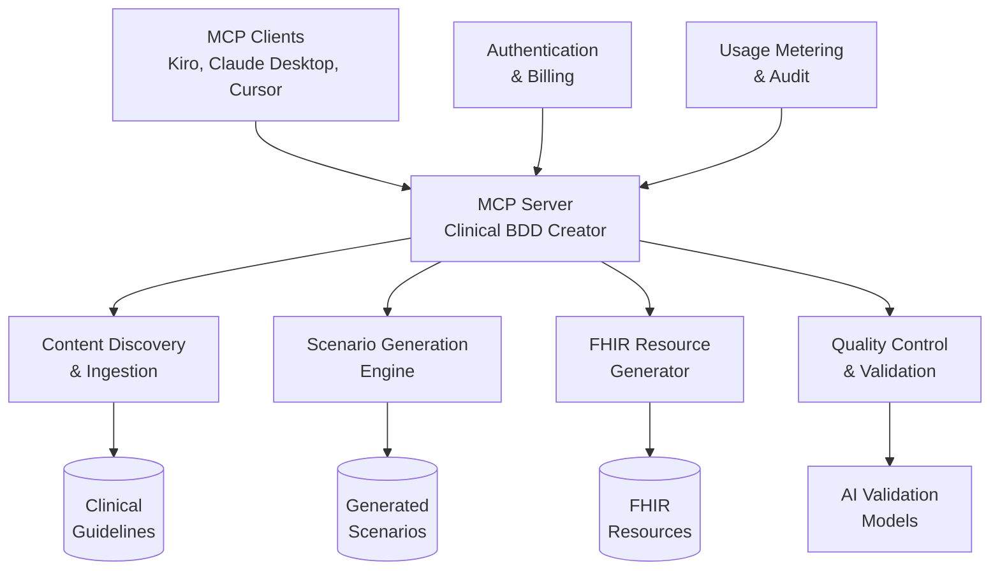

# Clinical BDD Creator - Requirements & Specifications

**Version:** 1.2.0
**Date:** November 7, 2025

## Executive Summary

The Clinical BDD Creator is an MCP (Model Context Protocol) service that transforms clinical guideline content from any source into executable Behavior-Driven Development (BDD) test scenarios. The system analyzes clinical guidelines and generates comprehensive test scenarios covering clinical decision points, treatment recommendations, diagnostic tests, and patient safety considerations.

The service supports the CIKG 4-Layer model and aligns with CDS usage scenarios to ensure generated tests are clinically relevant and standards-compliant. It provides multi-modal AI validation to ensure clinical accuracy through cross-model consistency checking.

## Key Features

- **Multi-Format Input Support**: Accepts clinical guidelines in markdown, XML, HTML, PDF, and FHIR formats
- **Advanced Generation Modes**: Top-down, bottom-up, external catalyst, and logic-derived scenario generation
- **Configurable Output Fidelity**: Draft inventory, full Gherkin features, or complete FHIR resources
- **Clinical Decision Support**: Automatic CDS taxonomy classification and FHIR resource generation
- **Quality Assurance**: Multi-modal AI validation, clinical reasoning benchmarking, and integration testing
- **MCP Protocol**: Native support for Model Context Protocol with WebSocket and JSON-RPC transport

## Architecture Overview

## Documentation Structure

This specification is organized into modular documents for improved maintainability and navigation:

### Core Documents

| Document | Description | Location |
|----------|-------------|----------|
| **[MCP Specifications](09-mcp/mcp-specifications.md)** | Protocol details, tool definitions, security, and client configurations | `spec-pack/09-mcp/mcp-specifications.md` |
| **[Core Requirements](01-ears/core-requirements.md)** | Detailed EARS-compliant functional requirements with workflow diagrams | `spec-pack/01-ears/core-requirements.md` |
| **[Glossary](01-ears/glossary.md)** | Comprehensive definitions of clinical, technical, and domain-specific terms | `spec-pack/01-ears/glossary.md` |
| **[Change Log](01-ears/changelog.md)** | Version history and change tracking | `spec-pack/01-ears/changelog.md` |

### Supporting Documents

| Document | Description | Location |
|----------|-------------|----------|
| **Development Plan** | Project phases, timeline, and collaboration guidelines | `spec-pack/11-plan/development_plan.md` |
| **MCP Manifest** | JSON configuration for MCP server registration | `spec-pack/09-mcp/mcp.json` |
| **Quality Tests** | BDD test scenarios for the system itself | `spec-pack/07-quality/tests.feature` |

## Quick Start

### For MCP Clients

1. **Install the MCP Server**: Follow client-specific installation instructions in [MCP Specifications](09-mcp/mcp-specifications.md)
2. **Configure Authentication**: Set up API keys and billing in your MCP client settings
3. **Start Using Tools**: Use the available MCP tools for clinical BDD generation

### For Developers

1. **Review Requirements**: Start with [Core Requirements](01-ears/core-requirements.md) for functional specifications
2. **Understand MCP Integration**: Read [MCP Specifications](09-mcp/mcp-specifications.md) for protocol details
3. **Check Implementation Status**: Refer to [Change Log](01-ears/changelog.md) for current version and features

## Development Status

### ✅ Completed Phases

- **Phase 1**: Planning and Prioritization - Requirements refinement and EARS compliance
- **Phase 2**: Structural Improvements - Document modularization, diagrams, and enhanced navigation

### 🔄 Current Phase

- **Phase 3**: Content Refinements - Adding assumptions, dependencies, risks, and enhanced acceptance criteria

### 📋 Upcoming Phases

- **Phase 4**: Validation and Review - Cross-checking consistency and EARS/MCP compliance
- **Phase 5**: Handover to Design - Transition to implementation with architecture diagrams

## Key Requirements Summary

### Functional Requirements (20 total)

| Category | Requirements | Key Features |
|----------|--------------|--------------|
| **Content Management** | Req 1, 16-17 | Multi-format ingestion, source flexibility, model abstraction |
| **Scenario Generation** | Req 2-4, 7 | Multi-mode generation, section-based processing, fidelity control |
| **Clinical Decision Support** | Req 5-6, 8 | CDS taxonomy, inventory management, FHIR resources |
| **Quality Control** | Req 9-15 | Rate limiting, metrics, deduplication, dry-run testing |
| **Testing & Validation** | Req 18-20 | Multi-modal AI validation, clinical benchmarking, integration testing |

### Non-Functional Requirements

- **Performance**: <2 second 95th percentile response times
- **Security**: API key authentication, HIPAA compliance, PII/PHI protection
- **Scalability**: Rate limiting (1-1000 RPS), usage metering
- **Reliability**: Circuit breaker patterns, graceful degradation
- **Compliance**: FHIR R4/R5 validation, CDS hooks support

## Quality Assurance

- **AI Validation**: Multi-modal consistency checking (≥80% agreement across GPT-4, Claude, Gemini)
- **Clinical Benchmarking**: Precision/recall metrics and explanation completeness validation
- **Integration Testing**: FHIR validation, CDS hooks testing, EHR interoperability
- **Code Quality**: Comprehensive linting, static analysis, and automated testing

## Support & Contact

- **Documentation**: All specifications maintained in `spec-pack/` directory
- **Issues**: Report bugs and request features via GitHub issues
- **Development**: Follow progress in `daily-notes/` and development plan
- **Clinical Validation**: Consult domain experts for clinical accuracy requirements

---

*This index provides navigation to the modular Clinical BDD Creator specification. For detailed implementation guidance, refer to the individual document sections linked above.*</content>

